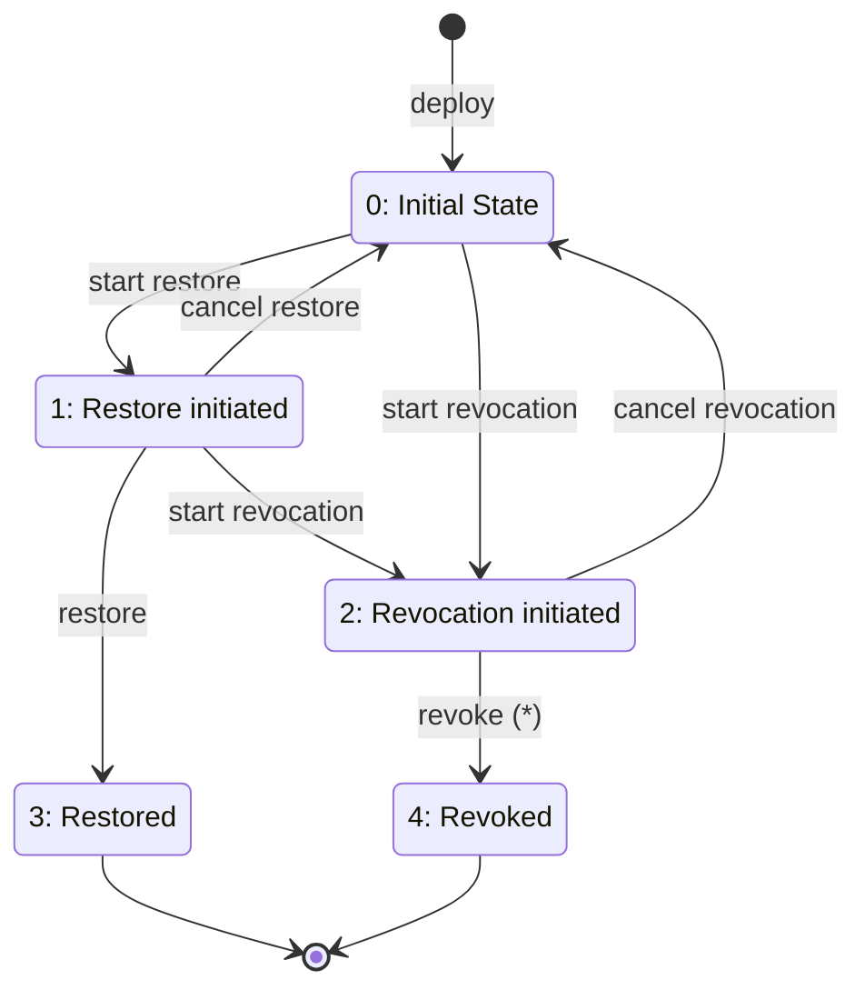
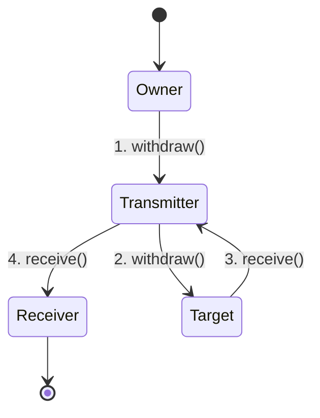
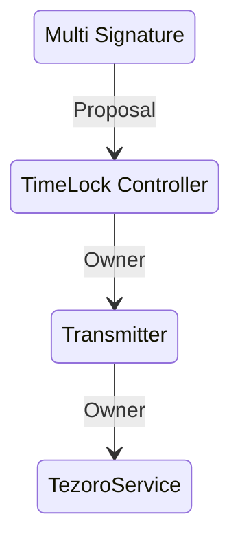
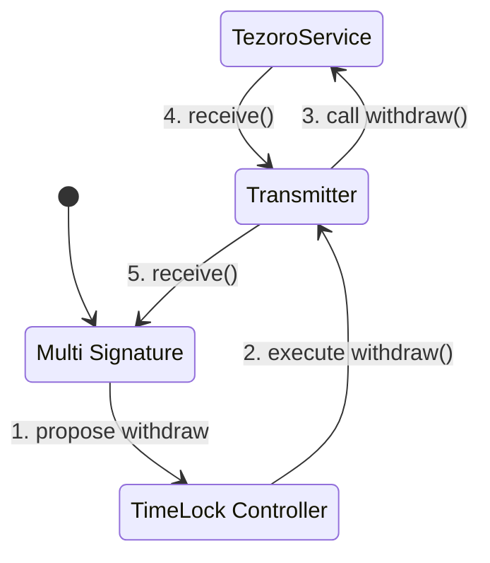

# Tezoro contract

## Contract fields 
| Signature | Description |
|--|--|
| `version` | contract version  |
|`creator` | address allowed to interact with contract |
|`executor1`| address partly allowed to interact with contract |
|`executor2`| address partly allowed to interact with contract |
|`tokenAddress`| address of token being transferred |
|`owner`| contract owner address |
|`beneficiary`| address where token will be transferred |
|`delay`| state changes delay interval (see below) |
|`initTimestamp`| contract creation timestamp |
|`state`| contract state |
|`timestamp`|timestamp when contract state was changed to current + delay|

## Constructor
Here is a signature of Tezoro constructor:
```solidity
constructor(
	address _creatorAddress,
	address _ownerAddress,
	address _executor1,
	address _executor2,
	address _beneficiaryAddress,
	address _tokenAddress,
	uint256 _delay
)
```
`_creatorAddress`, `_ownerAddress`, `_beneficiaryAddress` and `_tokenAddress` must not be zero addresses while `_executor1` and `_executor2` addresses are allowed to be zero (in that case they have no effect to contract execution logic). 

## Contract states
*Execution* of the Tezoro contract means transfer of token assets from owner account to beneficiary account. 

Contract field `state` indicates one of five possible contract states:

0. *Initial state* 
1. *Restore initiated* – state in which during `delay` period contract execution could be cancelled and after `delay` period contract could be only executed;
2. *Revocation initiated* – state in which during `delay` period contract revocation could be cancelled and after `delay` period contract will be revoked;
3. *Restored* – coming into this state contract is being executed and become inactive (terminal state)
4. *Revoked* – formal state indicating contract is revoked (i.e. it is terminal state and contract is not executed coming to it). 

Here is a diagram with legal contract state changes:


Here is a table describing possible state changes; 

 - **from** and **to** are codes of states contract is transferred from and to correspondingly
 - **when** is a time limitation for action: anytime means change is possible depends on current time, "after delay" means that action is allowed only after `delay` period past from previous state change, "before delay" means that action is allowed only before `delay` period past from previous state change
 - **who** is a list of addresses allowed to call the action: C – `creator`, O – `owner`, E1 – `executor1`, E2 – `executor2`

|action|from| to |when|who|
|--|--|--|--|--|
|start restoration |0|1|anytime|C, O, E1, E1|
|restore|1|3| after delay | C, O, E1, E1 |
|cancel restore| 1 | 0 | before delay | C, O 
|start revocation| 0 | 2 | anytime | C, O
|start revocation| 1 | 2 | before delay | C, O
|cancel revocation| 2 | 0 | before delay | C, O
|revoke (*)| 2 | 4 | after delay | C, O


# TezoroService contract
`TezoroService` contract is used as a factory contract for deploying instances of `Tezoro` and manage payments. 

## Contract fields 
| Signature | Description |
|--|--|
| `version` | contract version  |
|`serviceFee` |minimal service fee paid when new contract is deployed |
|`creator`| creator address for Tezoro contract |
|`multiSigOwner`|multisignature address only permitted to withdraw balance from TezoroSevice |
|`delay`| delay interval for state changes in Tezoro contracts |
|`withdrawalDelay`|time lock interval for withdrawals|
|`withdrawalTimestamp`| timestamp after which withdrawal is allowed |

## constructor
Here is a signature of TezoroService constructor:
```solidity
constructor(
	address _multiSigOwner,
	uint256 _initialServiceFee,
	uint256 _delay,
	uint256 _withdrawalDelay
)
```
All these parameters are immutable. Address `_multiSigOwner` is supposed to be an address of a multisignature wallet for security improvements. 
## Tezoro deploy
Deployment of Tezoro contracts is performed via payable `deployBackupContract()` method:
```solidity
function deployBackupContract(
	address _beneficiaryAddress,
	address _tokenAddress,
	address _executor1,
	address _executor2,
	bytes32 _userHash,
	bytes32 _metaId
)
```

## Ownership and withdrawals
`TezoroService` is ownable contract. Owner of the contract is only privileged address allowed to call `withdraw()` function which transfers entire contract balance to the owner address. 

To mitigate centralisation risks, ownership is delegated to multi signature wallet via time lock controller. In order to be able to receive the assets to address other than TimeLock Controller (where they cannot be withdrawn from), one more contract `Transmitter` is used.  

### Transmitter contract
`Transmitter` contract is an ownable contract which has two fields: `address target` and `address receiver`. 

Use case of this contract assumes that `target` contract 
- is ownable and its ownership is transfered to the  `Transmitter`;
- has `withdraw()` method which sends contract balance to the contract owner address.

Owner of the `Transmitter` contract is the only address privileged to call `withdraw()` method which will call `withdraw()`  method in `target` contract. After that, when `target` contract sends assets to `Transmitter`, it immediately sends it to `receiver` address: 

### Ownership configuration

`TezoroService` has following ownership configuration implemented:



### withdrawal process

Diagram below shows withdrawal process steps:



They are:
1. Multi signature wallet creates (using 2/3 votes) proposal of calling `withdraw()` method in Transmitter contract via TimeLock Controller;
2. After TimeLock delay (48 h), proposed transaction can be executed; this triggers `withdraw()` method in Transmitter contract
3. Transmitter contract calls `withdraw()` method in `TezoroService` contract, receives assets and sends it to multi signature wallet.

